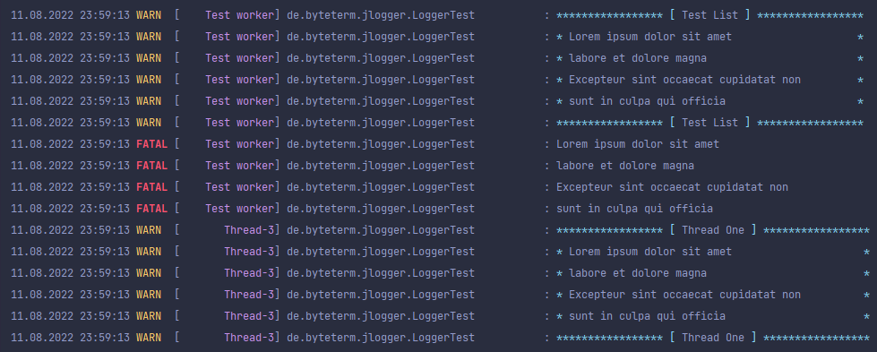

# JLogger

## About
This library contains everything you need for just about any project. 
This includes the reading of a Json file, for example, finding out the
operating system and of course the logging of messages. Here, new functions
are added constantly, because you only think about it little by little what
you need so constantly ;). The advantage of this library is that you do not always
have to write the same functions for each project but here directly has everything 
necessary in one. Here it is ensured that it is really functions that you need to
use more often. The logs are automatically indented, so that all messages have the
same format. In addition, it is possible to display a list, which also automatically
adjusts the size. Here is an example:



If you encounter any problems, have suggestions for improvement or if we can help 
you in any other way, you are welcome to join our Discord https://discord.gg/6sBNTXTJn4

Here you will also be informed about future projects, updates and possible functions.

## Setup Maven
If you are using maven, just do the following:

1. Add a new repository url
```xml
<project>
    ...
    <repositories>
        <repository>
            <id>byteterm-repo</id>
            <name>ByteTerm Repository</name>
            <url>https://nexus.byteterm.de/repository/maven-public/</url>
        </repository>
        ...
    </repositories>
    ...
</project>
```
2. Add this dependency to your project. Important: change the version. You can see all available versions here https://nexus.byteterm.de/service/rest/repository/browse/maven-public/de/byteterm/jlogger/
```xml
<project>
    ...
    <dependencies>
        <dependency>
            <groupId>de.byteterm</groupId>
            <artifactId>jlogger</artifactId>
            <version>1.1.2-SNAPSHOT</version>
        </dependency>
        ...
    </dependencies>
    ...
</project>
```

## Setup Gradle
If you are using gradle, just do the following:

1. Add a new repository url
```groovy
repositories {
    maven {
        url = 'https://nexus.byteterm.de/repository/maven-public/'
    }
}
```
2. Add this dependency to your project. Important: change the version. You can see all available versions here https://nexus.byteterm.de/service/rest/repository/browse/maven-public/de/byteterm/jlogger/
```groovy
dependencies {
    implementation 'de.byteterm:jlogger:1.1.2-SNAPSHOT'
}
```
## Using in Java Program
The following class is a simple example how to initialize and use this logging library.
```java
import de.byteterm.jlogger.Logger;

public class JLoggerExample {

    static Logger log = Logger.getLogger();

    public static void main(String[] args) {
        // Enable debug messages
        Logger.enableDebug(true);

        log.debug("Simple Debug message ;)");
        log.info("Simple info message");
    }
}

```